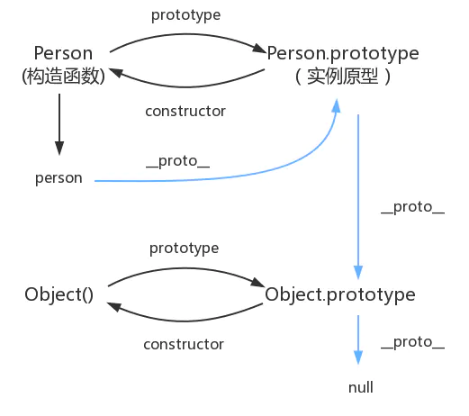

### js闭包
function Person() {
    var name = 'hello'
    function say () {
        console.log(name)
    }
    return say()
}
Person() // hello
<ul class="list">
      <li class="bloc">1</li>
      <li class="bloc">2</li>
      <li class="bloc">3</li>
      <li class="bloc">4</li>
      <li class="bloc">5</li>
 </ul>
  var ali = document.querySelectorAll('.wrap ul li')
  for(var i = 0,l = ali.length;i < l;i++){
 　　ali[i].onclick = function(){
        console.log(i)　　//5 5 5 5 5
    }
  }
    for(var i = 0,l = ali.length;i < l;i++){
 　　ali[i].onclick = function(j){
       return j　　//5 5 5 5 5
    }(i)
  }
由于js的特殊作用域函数外部无法直接读取函数内部的变量，内部可以直接读取函数外部的变量，从而产生了闭包的概念！
闭包优点：
可以读取到一个函数的内部的局部变量
让这些变量的值始终保存在内存中
闭包缺点
由于闭包会使函数中的变量都被保存在内存中，内存消耗很大，所以不能滥用闭包，否则后造成网页性能问题 ！很可能导致内存泄漏
### js引擎的工作过程
一个是语法检查阶段，一个是运行阶段。而运行阶段又分预解析和执行两个阶段。
### js基础常见面试题
https://www.jianshu.com/p/1c142ec2ca45

js 深拷贝 浅拷贝
B复制了A，当修改A时，看B是否会发生变化，如果B也跟着变了，说明这是浅拷贝，如果B没变，那就是深拷贝，
1. 如果是基本数据类型，名字和值都会储存在栈内存中
var a = 1;
b = a; // 栈内存会开辟一个新的内存空间，此时b和a都是相互独立的
b = 2;
console.log(a); // 1

常见浏览器优化
一.图片的优化
1.图片的压缩，使用png

2.使用图片的预加载

3.多个小图片的引用可以合并成一个大图片，精灵图的使用

4.src不为空

5.减少对图片宽高的自定义

二.css的优化
1.css进行合并处理，减少多个请求

2.尽量使用link，减少@import

3.使用less,sass

4.对css进行压缩

5.减少无效代码，注意公用样式

三.js的优化
1.js压缩

2.尽量不在head中引用

3.减少无效代码

4.js引用放在body最后

5.减少js对css样式的修改

6.减少真实dom的操作

四.HTML优化
1.尽量减少table的使用

2.尽量使用web语义化标签

五.http请求方面的优化
1.尽量减少http请求

2.和并http请求

3.开启gzip模块，gzip压缩是非常流行的一种数据压缩格式，一般网站启用gzip后，压缩率都会有70%-80%的提升，效果是立竿见影的

六.浏览器优化
1.开启浏览器缓存，缓存css,js，img

2.按需加载，把统计、分享等 js 在页面 onload 后再进行加载，可以提高访问速度；

3.优化 cookie ，减少 cookie 体积；

七.其他优化
1.使用免费 cdn 加载第三方资源

2.使用 cdn 储存静态资源

3.减少重绘和重排

4.按需加载

5.避免重定向

6.减少DNS查找

7.避免CSS表达式

8.添加Expires头

9.使Ajax可缓存
http 状态码
1**	信息，服务器收到请求，需要请求者继续执行操作
2**	成功，操作被成功接收并处理
3**	重定向，需要进一步的操作以完成请求
4**	客户端错误，请求包含语法错误或无法完成请求
5**	服务器错误，服务器在处理请求的过程中发生了错误
401 当前用户没有权限，需要进行身份验证

import和require的区别
require 是 AMD规范引入方式
import是es6的一个语法标准，如果要兼容浏览器的话必须转化成es5的语法
调用时间

require是运行时调用，所以require理论上可以运用在代码的任何地方
import是编译时调用，所以必须放在文件开头
require是赋值过程，其实require的结果就是对象、数字、字符串、函数等，再把require的结果赋值给某个变量
import是解构过程，但是目前所有的引擎都还没有实现import，我们在node中使用babel支持ES6，也仅仅是将ES6转码为ES5再执行，import语法会被转码为require

原型 和原型链 

在JavaScript中，每个函数都有一个prototype属性，这个属性指向函数的原型对象。
原型的概念：每一个javascript对象(除null外)创建的时候，就会与之关联另一个对象，这个对象就是我们所说的原型，每一个对象都会从原型中“继承”属性。
百度回车
1. 解析url
浏览器首先对拿到的URL进行识别，抽取出域名字段
2. DNS解析
获取域名对应的IP然后向IP地址定位的HTTP服务器发起TCP连接
3. 浏览器与网站建立TCP连接（三次握手）
4. 请求和传输数据
5. 浏览器渲染页面
 客户端拿到服务器端传输来的文件，找到HTML和MIME文件，通过MIME文件，浏览器知道要用页面渲染引擎来处理HTML文件。

ａ.浏览器会解析html源码，然后创建一个 DOM树。

在DOM树中，每一个HTML标签都有一个对应的节点，并且每一个文本也都会有一个对应的文本节点。

b.浏览器解析CSS代码，计算出最终的样式数据，形成css对象模型CSSOM。

首先会忽略非法的CSS代码，之后按照浏览器默认设置——用户设置——外链样式——内联样式——HTML中的style样式顺序进行渲染。

c.利用DOM和CSSOM构建一个渲染树（rendering tree）。
渲染树和DOM树有点像，但是是有区别的。

DOM树完全和html标签一一对应，但是渲染树会忽略掉不需要渲染的元素，比如head、display:none的元素等。

而且一大段文本中的每一个行在渲染树中都是独立的一个节点。
渲染树中的每一个节点都存储有对应的css属性。

ｄ.浏览器就根据渲染树直接把页面绘制到屏幕上。

答案二

1、首先，在浏览器地址栏中输入url，先解析url，检测url地址是否合法
2、浏览器先查看浏览器缓存-系统缓存-路由器缓存，如果缓存中有，会直接在屏幕中显示页面内容。若没有，则跳到第三步操作。
浏览器缓存：浏览器会记录DNS一段时间，因此，只是第一个地方解析DNS请求；
操作系统缓存：如果在浏览器缓存中不包含这个记录，则会使系统调用操作系统，获取操作系统的记录(保存最近的DNS查询缓存)；
路由器缓存：如果上述两个步骤均不能成功获取DNS记录，继续搜索路由器缓存；
ISP缓存：若上述均失败，继续向ISP搜索。
3、在发送http请求前，需要域名解析(DNS解析)，解析获取相应的IP地址。
4、浏览器向服务器发起tcp连接，与浏览器建立tcp三次握手。
5、握手成功后，浏览器向服务器发送http请求，请求数据包。
6、服务器处理收到的请求，将数据返回至浏览器
7、浏览器收到HTTP响应
8、浏览器解码响应，如果响应可以缓存，则存入缓存。
9、 浏览器发送请求获取嵌入在HTML中的资源（html，css，javascript，图片，音乐······），对于未知类型，会弹出对话框。
10、 浏览器发送异步请求。
11、页面全部渲染结束。

作用域、预解析和声明提升
作用域:是指对某一变量和方法具有访问权限的代码空间，也就是变量或函数起作用的区域
作用域链：在查找变量的时候会先从自身的作用域区查找，找不到再到上一级的作用域查找，如果还没找到就 到 全局作用域区查找，这样就形成了一个作用域链。