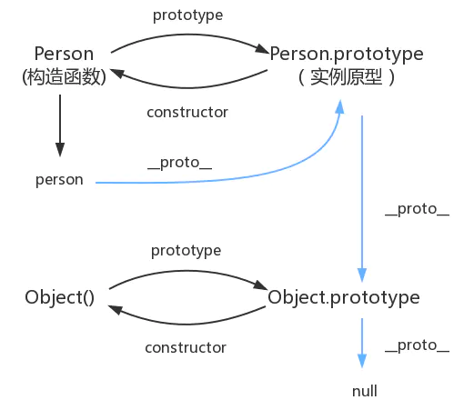

### js 闭包

闭包简单理解成"定义在一个函数内部的函数"。
变量的作用域无非就是两种：全局变量和局部变量。
闭包的本质：利用作用域访问规则的不可逆性，构成一个单向的空间。
闭包优缺点：
function Person() {
var name = 'hello'
function say () {
console.log(name)
}
return say()
}
Person() // hello

<ul class="list">
      <li class="bloc">1</li>
      <li class="bloc">2</li>
      <li class="bloc">3</li>
      <li class="bloc">4</li>
      <li class="bloc">5</li>
 </ul>
  var ali = document.querySelectorAll('.wrap ul li')
  for(var i = 0,l = ali.length;i < l;i++){
 　　ali[i].onclick = function(){
        console.log(i)　　//5 5 5 5 5
    }
  }
    for(var i = 0,l = ali.length;i < l;i++){
 　　ali[i].onclick = function(j){
       return j　　//5 5 5 5 5
    }(i)
  }
由于js的特殊作用域函数外部无法直接读取函数内部的变量，内部可以直接读取函数外部的变量，从而产生了闭包的概念！
闭包优点：
可以读取到一个函数的内部的局部变量
让这些变量的值始终保存在内存中
闭包缺点
由于闭包会使函数中的变量都被保存在内存中，内存消耗很大，所以不能滥用闭包，否则后造成网页性能问题 ！很可能导致内存泄漏
### js引擎的工作过程
一个是语法检查阶段，一个是运行阶段。而运行阶段又分预解析和执行两个阶段。
### js基础常见面试题
https://www.jianshu.com/p/1c142ec2ca45

js 深拷贝 浅拷贝
B 复制了 A，当修改 A 时，看 B 是否会发生变化，如果 B 也跟着变了，说明这是浅拷贝，如果 B 没变，那就是深拷贝，

1. 如果是基本数据类型，名字和值都会储存在栈内存中
   var a = 1;
   b = a; // 栈内存会开辟一个新的内存空间，此时 b 和 a 都是相互独立的
   b = 2;
   console.log(a); // 1

常见浏览器优化
一.图片的优化 1.图片的压缩，使用 png

2.使用图片的预加载

3.多个小图片的引用可以合并成一个大图片，精灵图的使用

4.src 不为空

5.减少对图片宽高的自定义

二.css 的优化
1.css 进行合并处理，减少多个请求

2.尽量使用 link，减少@import

3.使用 less,sass

4.对 css 进行压缩

5.减少无效代码，注意公用样式

三.js 的优化
1.js 压缩

2.尽量不在 head 中引用

3.减少无效代码

4.js 引用放在 body 最后

5.减少 js 对 css 样式的修改

6.减少真实 dom 的操作

四.HTML 优化 1.尽量减少 table 的使用

2.尽量使用 web 语义化标签

五.http 请求方面的优化 1.尽量减少 http 请求

2.和并 http 请求

3.开启 gzip 模块，gzip 压缩是非常流行的一种数据压缩格式，一般网站启用 gzip 后，压缩率都会有 70%-80%的提升，效果是立竿见影的

六.浏览器优化 1.开启浏览器缓存，缓存 css,js，img

2.按需加载，把统计、分享等 js 在页面 onload 后再进行加载，可以提高访问速度；

3.优化 cookie ，减少 cookie 体积；

七.其他优化 1.使用免费 cdn 加载第三方资源

2.使用  cdn 储存静态资源

3.减少重绘和重排

4.按需加载

5.避免重定向

6.减少 DNS 查找

7.避免 CSS 表达式

8.添加 Expires 头

9.使 Ajax 可缓存
http 状态码
1** 信息，服务器收到请求，需要请求者继续执行操作
2** 成功，操作被成功接收并处理
3** 重定向，需要进一步的操作以完成请求
4** 客户端错误，请求包含语法错误或无法完成请求
5\*\* 服务器错误，服务器在处理请求的过程中发生了错误
401 当前用户没有权限，需要进行身份验证
403 ("Forbidden")
import 和 require 的区别
require 是 AMD 规范引入方式
import 是 es6 的一个语法标准，如果要兼容浏览器的话必须转化成 es5 的语法
调用时间

require 是运行时调用，所以 require 理论上可以运用在代码的任何地方
import 是编译时调用，所以必须放在文件开头
require 是赋值过程，其实 require 的结果就是对象、数字、字符串、函数等，再把 require 的结果赋值给某个变量
import 是解构过程，但是目前所有的引擎都还没有实现 import，我们在 node 中使用 babel 支持 ES6，也仅仅是将 ES6 转码为 ES5 再执行，import 语法会被转码为 require

原型 和原型链

在 JavaScript 中，每个函数都有一个 prototype 属性，这个属性指向函数的原型对象。
原型的概念：每一个 javascript 对象(除 null 外)创建的时候，就会与之关联另一个对象，这个对象就是我们所说的原型，每一个对象都会从原型中“继承”属性。
百度回车

1. 解析 url
   浏览器首先对拿到的 URL 进行识别，抽取出域名字段
2. DNS 解析
   获取域名对应的 IP 然后向 IP 地址定位的 HTTP 服务器发起 TCP 连接
3. 浏览器与网站建立 TCP 连接（三次握手）
4. 请求和传输数据
5. 浏览器渲染页面
   客户端拿到服务器端传输来的文件，找到 HTML 和 MIME 文件，通过 MIME 文件，浏览器知道要用页面渲染引擎来处理 HTML 文件。

ａ.浏览器会解析 html 源码，然后创建一个 DOM 树。

在 DOM 树中，每一个 HTML 标签都有一个对应的节点，并且每一个文本也都会有一个对应的文本节点。

b.浏览器解析 CSS 代码，计算出最终的样式数据，形成 css 对象模型 CSSOM。

首先会忽略非法的 CSS 代码，之后按照浏览器默认设置——用户设置——外链样式——内联样式——HTML 中的 style 样式顺序进行渲染。

c.利用 DOM 和 CSSOM 构建一个渲染树（rendering tree）。
渲染树和 DOM 树有点像，但是是有区别的。

DOM 树完全和 html 标签一一对应，但是渲染树会忽略掉不需要渲染的元素，比如 head、display:none 的元素等。

而且一大段文本中的每一个行在渲染树中都是独立的一个节点。
渲染树中的每一个节点都存储有对应的 css 属性。

ｄ.浏览器就根据渲染树直接把页面绘制到屏幕上。

答案二

1、首先，在浏览器地址栏中输入 url，先解析 url，检测 url 地址是否合法
2、浏览器先查看浏览器缓存-系统缓存-路由器缓存，如果缓存中有，会直接在屏幕中显示页面内容。若没有，则跳到第三步操作。
浏览器缓存：浏览器会记录 DNS 一段时间，因此，只是第一个地方解析 DNS 请求；
操作系统缓存：如果在浏览器缓存中不包含这个记录，则会使系统调用操作系统，获取操作系统的记录(保存最近的 DNS 查询缓存)；
路由器缓存：如果上述两个步骤均不能成功获取 DNS 记录，继续搜索路由器缓存；
ISP 缓存：若上述均失败，继续向 ISP 搜索。
3、在发送 http 请求前，需要域名解析(DNS 解析)，解析获取相应的 IP 地址。
4、浏览器向服务器发起 tcp 连接，与浏览器建立 tcp 三次握手。
5、握手成功后，浏览器向服务器发送 http 请求，请求数据包。
6、服务器处理收到的请求，将数据返回至浏览器
7、浏览器收到 HTTP 响应
8、浏览器解码响应，如果响应可以缓存，则存入缓存。
9、 浏览器发送请求获取嵌入在 HTML 中的资源（html，css，javascript，图片，音乐······），对于未知类型，会弹出对话框。
10、 浏览器发送异步请求。
11、页面全部渲染结束。

作用域、预解析和声明提升
作用域:是指对某一变量和方法具有访问权限的代码空间，也就是变量或函数起作用的区域
作用域链：在查找变量的时候会先从自身的作用域区查找，找不到再到上一级的作用域查找，如果还没找到就 到 全局作用域区查找，这样就形成了一个作用域链。
