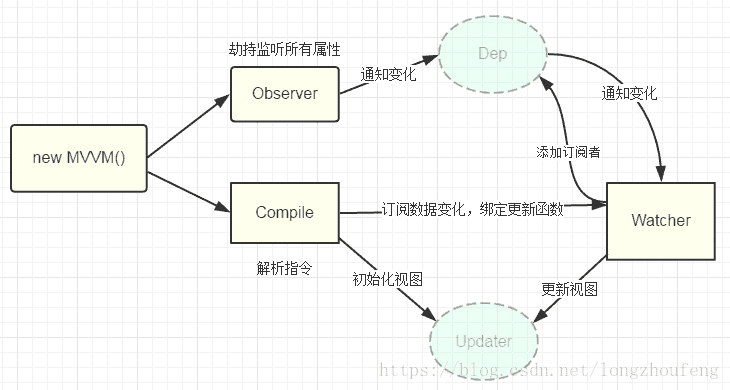

### vue 生命周期

beforeCreate
created
beforeMount
mounted
beforeUpdate
updated
beforeDestroy
destroyed

### vue 双向数据绑定原理

数据劫持
vue.js 则是采用数据劫持结合发布者-订阅者模式的方式，通过 Object.defineProperty()来劫持各个属性的 setter，getter，在数据变动时发布消息给订阅者，触发相应的监听回调。

vue 常见面试题

1. v-show 和 v-if 的区别
   (1)v-show 通过 css display 控制显示和隐藏；
   (2)v-if 组件真正的渲染和销毁，而不是隐藏和显示；
   (3)频繁切换使用 v-show，否则使用 v-if；
2. 为何会在 v-for 中使用 key？
   key 的作用是为了在 diff 算法执行时更快的找到对应的节点，提高 diff 速度
   (1)必须用 key，且不是 random 和 index；
   (2)diff 算法中通过 tag 和 key 来判断是否是 sameName（相同）；
   (3)减少渲染次数，提升性能。
3. vue 生命周期
4. 组件通信方式（常见）
   (1)父传子 props
   (2)子传父$emit
   (3)自定义组件：event.$on event.$off event.$emit
   (4)vuex
5. 描述组件渲染和更新的过程
   https://blog.csdn.net/qq_38588845/article/details/106039460
6. 双向数据绑定的实现原理
7. 对 MVVM 的理解
8. computed 特点
9. 为何 data 必须是一个函数？
   https://www.jianshu.com/p/f3e774c57356
   我们可以发现当我们使用组件的时候，虽然 data 是在构造器的原型链上被创建的，但是实例化的 component1 和 component2 确是共享同样的 data 对象,当你修改一个属性的时候，data 也会发生改变，这明显不是我们想要的效果。
   data 是函数创建的实例互不影响修改其中一个实例，另一个实例不会被影响
   我们定义的组件实际上是一个个 class，每次在使用的时候实际上是对 class 的实例化，如果是变量的会影响别的组件。
10. mixins
    https://www.cnblogs.com/Ivy-s/p/10022636.html
11. 路由懒加载几种方式
    像 vue 这种单页面应用，如果没有应用懒加载，运用 webpack 打包后的文件将会异常的大，造成进入首页时，需要加载的内容过多，时间过长，会出啊先长时间的白屏，即使做了 loading 也是不利于用户体验，而运用懒加载则可以将页面进行划分，需要的时候加载页面，可以有效的分担首页所承担的加载压力，减少首页加载用时

    1. vue 异步组件
       { path: '/home', name: 'home', component: resolve => require(['@/components/home'],resolve) },
    2. es 提案的 import()
       const Index = () => import('@/components/index')
    3. webpack 的 require,ensure()
       vue-router 配置路由，使用 webpack 的 require.ensure 技术，也可以实现按需加载。
       这种情况下，多个路由指定相同的 chunkName，会合并打包成一个 js 文件。
       { path: '/home', name: 'home', component: r => require.ensure([], () => r(require('@/components/home')), 'demo') },

12. 何时使用 keep-alive？
    keep-alive 是缓存组件在不需要重复渲染但是需要切换显示隐藏状态的，如多个静态 tab 页切换，可以起到性能优化的作用。
13. 什么是作用域插槽？
14. 何时使用 beforeDestory？
    (1)解绑自定义事件 event.\$off；
    (2)清除计时器；
    (3)解绑自定义 DOM 事件；
    (4)关闭 websocket 请求；
15. vuex 中 action 和 mutation 有何区别？
    mapState,mapGetters, mapActions, mapMutations
16. Vue-router 常用的路由模式，原理是什么
    https://zhuanlan.zhihu.com/p/27588422
    (1)hash（默认）：通过 windows.onhashchange 实现
    (2)history（需要服务端支持）：通过 history.pushState 和 window.onpopState 实现。
    根据 MDN 的介绍，调用 history.pushState()相比于直接修改 hash 主要有以下优势：

    1. pushState 设置的新 URL 可以是与当前 URL 同源的任意 URL；而 hash 只可修改#后面的部分，故只可设置与当前同文档的 URL

    2. pushState 设置的新 URL 可以与当前 URL 一模一样，这样也会把记录添加到栈中；而 hash 设置的新值必须与原来不一样才会触发记录添加到栈中

    3. pushState 通过 stateObject 可以添加任意类型的数据到记录中；而 hash 只可添加短字符串

    4. pushState 可额外设置 title 属性供后续使用

### Vue3.0 的新特性

○ 虚拟 DOM 重写

○ 优化 slots 的生成

○ 静态树提升

○ 静态属性提升

○ 基于 Proxy 的响应式系统
